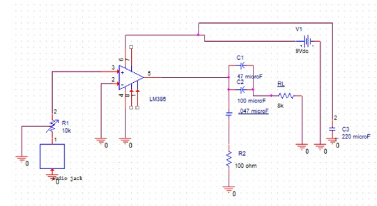

# Audio-amplifying-using-LM386-chip
Audio amplifying 
Audio Amplifier Project using LM386 Chip
Description
This project involves building an audio amplifier circuit using the LM386 integrated circuit. The LM386 is a low voltage audio power amplifier designed for consumer applications. It provides an efficient solution to amplify small audio signals to drive a speaker.

Components
3.5mm Headphone Cable (1)
Speaker (8 ohms) (1)
Audio Jack 3.5 Stereo closed (1)
Audio Power Amplifier (LM386N) (1)
47µF Capacitor (2)
220µF Capacitor (1)
IC Socket (1)
0.047µF Capacitor (1)
Resistor (100 ohms) (1)
Potentiometer (10k ohms) (1)
Circuit Diagram
[Insert your schematic image here]
Example: 

Schematic
Here is the schematic for the audio amplifier circuit:

Pin 2 (Inverting Input): Connect to ground.
Pin 3 (Non-Inverting Input): Connect to the audio input through a 10kΩ potentiometer for volume control.
Pin 4 (Ground): Connect to the ground rail.
Pin 5 (Output): Connect to the positive terminal of the speaker. Connect a 47 µF and 100 µF capacitor between pin 5 and the speaker to block DC.
Pin 6 (Vcc): Connect to the positive rail of the power supply (9V) and bypass to the ground to minimize noise.
Assembly Instructions
Place the LM386 IC on the breadboard.
Connect the capacitors and resistors according to the schematic.
Attach the potentiometer for volume control to the input signal line.
Wire the speaker to the output pin of the LM386 through the 220µF capacitor.
Connect the power supply (9V battery or DC adapter) to the Vcc and ground pins.
Testing the Amplifier
Connect the Input Source: Attach the audio input source (e.g., smartphone, MP3 player) to the input terminals.
Adjust the Volume: Use the potentiometer to adjust the volume level.
Power On the Circuit: Turn on the power supply and play audio from the input source.
Listen to the Amplified Sound: The speaker should output the amplified audio signal.

